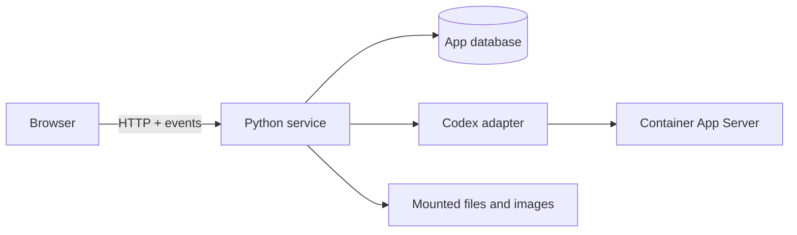

# Architecture

The application uses a browser client, Python service, Codex adapter, local database, and explicitly mounted storage. Python owns orchestration; native code is reserved for measured hot paths.

The MVP bundles and runs `codex app-server` inside the web container. It mounts `~/.codex` and the absolute `CODEX_WORKSPACES` host path at the identical absolute container path, so stored Codex working directories remain valid. Codex can use container-installed tools and mounted files only; other host-installed tools are unavailable.

The browser never launches Codex or reads host paths directly. The service validates resource identifiers and workspace-relative paths. Only `backend/app/codex_client.py` understands the upstream JSONL protocol. Its 512-event subscriber queues drop the oldest queued event when full; there is no persisted replay. The frontend merges streamed delta events by item ID, hydrates pending approvals, updates context usage, and shows explicit errors rather than substituting demo history/files while connected. Approval UI state changes only after a successful response POST; failure preserves the pending card for retry. The backend does not persist first-class interactive Run rows or enforce one mutating interactive run per thread itself.

## Gaps

- Formalize/test the compatibility normalization in `frontend/src/api.ts`; it intentionally accepts multiple supported upstream envelope shapes.
- Add persisted replay/reconnect and explicit run ownership/process reconciliation.
- External host App Server support is desired design, not current architecture.
