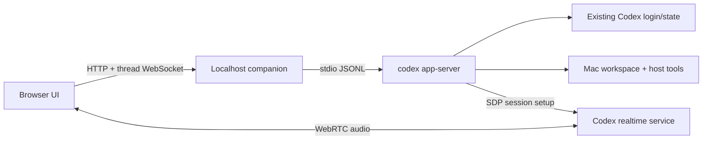

# Architecture

## Status

Implemented modular-monolith Mac companion with an optional legacy container deployment.

## Source Sync

- Companion assembly and HTTP boundaries: `backend/app/main.py`.
- Bounded workspace and Git adapter: `backend/app/workspace.py`.
- App Server process adapter: `backend/app/codex_client.py`.
- Browser API/event adapter: `frontend/src/api.ts`.
- Browser WebRTC ownership: `frontend/src/realtime.ts`.
- Browser shell and context-tool registry: `frontend/src/App.tsx`, `frontend/src/context-tools.ts`, and `frontend/src/styles.css`.
- Mac lifecycle: `tools/run-mac.sh`.
- Optional Linux lifecycle: `Dockerfile`, `docker-compose.yml`, and `tools/bootstrap.sh`.

## Behavior

The primary topology is a React browser client and loopback FastAPI companion running as the signed-in Mac user. The companion owns the only App Server subprocess and is the sole JSONL protocol peer. It exposes task-specific HTTP endpoints and thread-scoped WebSockets; it is not a generic command proxy.

SQLite stores only app-owned projects, thread metadata, settings, and schedules. Codex remains authoritative for transcript/history and thread continuation. The workspace service roots file reads/writes under one configured directory. The browser never launches Codex, reads credentials, or accesses arbitrary host paths.

The desktop shell assigns named CSS Grid areas to the application rail, conversation navigation, primary conversation, and optional context panel. The right panel is a presentation-level tool host, not a new generic backend boundary. Its registry distinguishes views backed by existing event/thread/workspace adapters from planned views that intentionally make no network or App Server call. The only terminal projection is the public thread-scoped background-process inventory; the Changes projection is a fixed read-only Git adapter.

The App Server subscriber uses bounded 512-event queues and drops the oldest queued event when full. There is no persisted event replay. Thread sockets forward events with a matching `threadId` plus explicitly global `webui/*` and `account/*` events. The browser reconnects a dropped socket and rereads `thread/read`; notifications arriving during that hydration are buffered and applied afterward. Turn state is derived from public turn status, never from an animation timer. Realtime SDP and state use that same ordered stream when the live capability probe allows voice; media itself is browser-owned WebRTC.

The optional container topology keeps the same modules but owns an in-container Codex process and therefore has container tools rather than the Mac host toolchain.

## Verification

Backend API tests verify route-to-protocol projection, scoping, origin checks, and degraded mode. Frontend tests verify normalization, WebRTC setup, and the context-tool registry. Browser checks assert the rendered left-to-right geometry and responsive drawer behavior. `tools/run-mac.sh` enforces loopback binding. Full repository checks run through `tools/validate.sh`.

## Gaps

- Add bounded server-side event replay if the App Server exposes a supported replay contract; current reconnect is history hydration rather than replay.
- Add a signed `.app` or launch-agent wrapper only if native lifecycle integration becomes required.
- Decide whether to retain the container topology long term.
